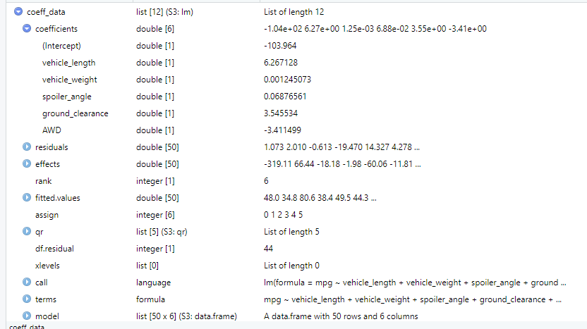
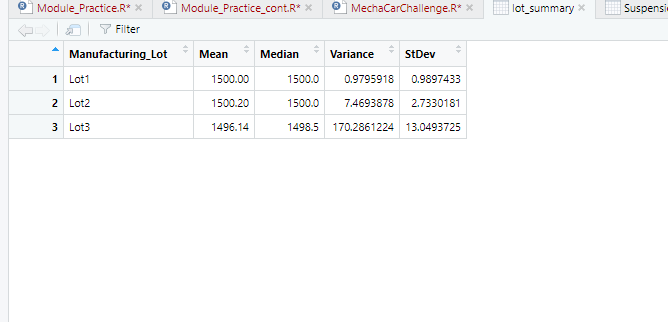
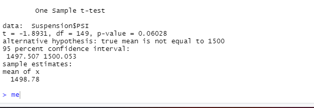
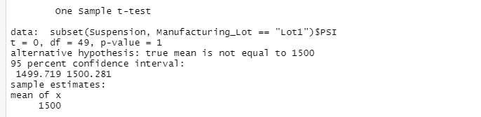
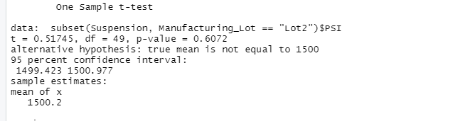
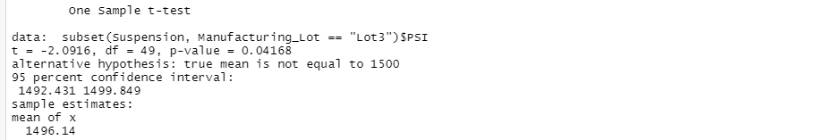

# MechaCar_Statistical_Analysis

## Purpose

The purpose of the challenge is to:

- Perform multiple linear regression analysis to identify which variables in the dataset predict the mpg of MechaCar prototypes.
- Collect summary statistics on the pounds per square inch (PSI) of the suspension coils from the manufacturing lots.
- Run t-tests to determine if the manufacturing lots are statistically different from the mean population.

### Linear Regression analysis to predict MPG

Performing linear regression analysis on given dataset reveals following results

### Summary of Linear Regression

- From the summary statics obtained on Linear regression two parameters vehicle length with a p-value of 260e-12 and ground clearance with a p-value of 5.21e-8 contributes to non-random amounts of variance as applied to the mpg values.
- The slopes of the variables are shown to be non-zero even though some are close to zero
- The model seems to be good predictive power for the MPG as the squared value of r is 0.7149
Coefficients:
vehicle length: 6.267
vehicle weight: .001
spoiler angle: .069
ground clearance: 3.546
AWD: -3.411

### Summary Statistics on Suspension Coils and each manufacturing lot 

The Summary statistics on Suspension Coils reveals following result

- From the above results it is infered in the total summary, the variance of all three lots falls under the maximum variance of 100 PSI with a variance of 62 PSI.
- But when summary statics is drilled down for each lot it is interpreted that the major contributor to the variance is lot 3 with a variance of 170 PSI with the other two lots having variances below 8 PSI.
- On the hole the manufacturing data meets the maximum variance in PSI requirement but lot 3 with a variance of 170 PSI does not meet the maximum variance requirement.

### T-Tests on Suspension Coils

- In the irst t-test, the sample mean is not statistically different from the population mean of 1500 PSI with a p-value of 0.06.

- However, when t-tests are done on the individual lots, it is observed, lots 1 and 2 are not statistically different from the population mean with p-values of 1 and 0.6 respectively, lot 3 does have a mean which is statistically different from the population mean with a p-value of 0.04.
    1. T-test for Lot 1
        p-value = 1, alpha = .05
    2.  T-test for Lot 2
        p-value = .6072, alpha = .05
    3. T-test for Lot 3
        p-value = .04168, alpha = .05

### Design a Study Comparing the MechaCar to the Competition

In order to address the performance of the MechaCar against the competition, we need to analyze several other parameters that could be interesting to the customers. 
These variables include cost, city and highway fuel efficiency, horsepower, safety rating, and carbon waste output.

- The next metrics to test should be the safety rating,carbon waste, horsepower, and highway fuel efficiency, which can address safety concerns of consumers.

- The null hypothesis will be that these observables don't vary significantly from the competition, and the alternative hypothesis will be that the MechaCar does indeed vary significantly in these variables compared to the competition.

- Multiple linear regression statistical summary would be best metrics to show how the variables impact the safety ratings for MechaCar and their competitors.

- In order to run these statistical tests, we would need the cost, fuel efficiency, horsepower, safety rating, and carbon waste output data from the MechaCar as well as the MechaCar's competitors.